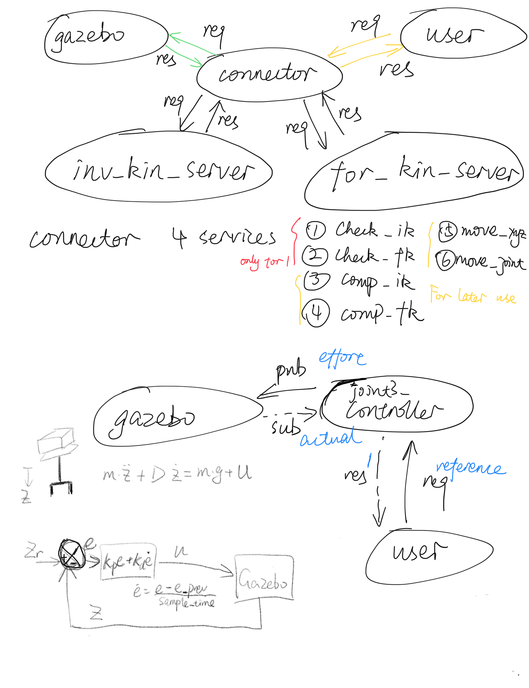

# SCARA Final Project

* **Author**:  WPI RBE 500 2019 Fall Team 8

  ​                 Katharine Conroy, Thejus Jose, Zhuoyun Zhong

## Install

Environment: Ubuntu 16.04 + ROS Kinectic

To install gazebo controllers:

`sudo apt-get install ros-kinetic-joint-state-controller`
`sudo apt-get install ros-kinetic-effort-controllers`
`sudo apt-get install ros-kinetic-position-controllers`

Build Instruction

1. Clone this repository under **catkin_ws/src/**
2. Compile under **catkin_ws**: `catkin_make`
3. Go to path: **catkin_ws/src/scara/scara_command/src/**
4. Give python files permission: `chmod +x get_homogeneous.py scara_connector.py scara_FK_server.py scara_IK_server.py joints_pos_controller.py joints_vel_controller.py scara_VK_server.py switch_control.py ` .

## Launch the SCARA Robot

To see the robot in rviz:

`roslaunch scara_description scara_rviz.launch`

To generate the robot in gazebo:

`roslaunch scara_gazebo scara_world.launch`

## Project Detail

#### Project 1

---

Project 1 implements three nodes including a forward kinematic, an inverse kinematic and a connector. To use these nodes, run them by

`roslaunch scara_command pos_kinematic.launch`

After opening all the nodes, there will be some services. The first two nodes provide inverse kinematic and forward kinematic calculation.

`rosservice call inv_kin x, y, z, phi, theta, psi` 

`rosservice call for_kin q1, q2, d3 `

The connector builds bridges for connecting gazebo robot and kinematic nodes. The service it provides does not need any input but requires that the robot in gazebo is working. It takes the pose/joint variables of the robot in gazebo and calls `compute_ik`/`compute_fk` to compute the result. It will give both the computed joint variables/pose result and gazebo joint variables/pose data for comparison. If the error is less than 0.01, one could confirm that the nodes are working correctly.

`rosservice call check_ik` 

`rosservice call check_fk` 

#### Project 2

---

Project 2 is to implemented and tuned a PD position controller. For better performance, we tuned the parameters in a new SCARA robot which has only one joint working and all the others fixed.

Generate SCARA 2 in gazebo:

`roslaunch scara_gazebo scara2_world.launch`

This time only joint 3 can be controlled and the available range for joint 3 is from 0 to 0.3 meters.

To control joint 3 with joints_pos_controller server:

`rosrun scara_command joints_pos_controller.py`

To give a reference position to the PD controller:

`rosservice call set_joint_pos_ref '{joint_name: joint3, ref: 0.2}'`  

One should be able to see the joint 3 moves to the desired position.

To tuned the value and see the result in real time, suggest using `rqt`. More detail of tunning process can refer to [Gazebo Control Tutorial](http://gazebosim.org/tutorials?tut=ros_control).

Repeat this process for all the three joints. After getting reasonable controller parameters, change the PD values in the file `scara_control/config/scara_control.yaml`

#### Project 3

---

Project 3 is to first implement a node for forward and inverse velocity kinematic. To use this node:

`rosrun scara_command  get_homogeneous.py` (if not run before)

`rosrun scara_command  scara_VK_server.py`

The node provides inverse velocity kinematic and forward velocity kinematic calculation.

`rosservice call vel_inv_kin x, y, z, q1, q2, q3, Vx, Vy, Vz, Wx, Wy, Wz` 

`rosservice call vel_for_kin q1, q2, q3, q1_dot, q2_dot, q3_dot `

Then is to implement and tune a velocity controller for the robot.

Similar to project 2 mentioned above, use a robot with only one joint movable to tune the controller.

`roslaunch scara_gazebo scara2_world.launch`

The default controller of the robot is the position controller. In order to use a velocity controller, we need to use `controller manager`of ROS to switch from position controller to velocity controller.

`rosservice call /scara/controller_manager/switch_controller '{start_controllers: [joint3_velocity_controller], stop_controllers: [joint3_position_controller], strictness: 2}`

To control joint 3 with joints_vel_controller server:

`rosrun scara_command joints_vel_controller.py`

To give a reference speed to the PD controller:

`rosservice call set_joint_vel_ref '{joint_name: joint3, ref: 4}'`  

One should be able to see the joint 3 moves at desired speed and ends up at the position of 0.3.

To tuned the value and see the result in real time, suggest using `rqt`. More detail of tunning process can refer to [Gazebo Control Tutorial](http://gazebosim.org/tutorials?tut=ros_control).

Repeat this process for all the three joints. After getting reasonable controller parameters, change the PD values in the file `scara_control/config/scara_control.yaml`

#### Integration

---

The final goal of the this project is to combine inverse position and velocity kinematics with position and velocity controllers. In this way, when one gives the robot a Cartesian coordinate or a desired speed of the end of effector, the robot could figure out how to get there itself using inverse kinematics, which is usually what people would like the robots to do.

First, position controllers and velocity controllers are two different controllers, one can only use one of them for controlling one joint. To switch controller of all the three joints between position controllers and velocity controllers, one can use the server provided by `switch_control.py`. The parameter "p2v" represents changing from position controller to velocity controller and "v2p" plays a similar role.

`rosrun scara_command switch_control.py` 

`rosservice call switch_control 'p2v'` 

`rosservice call switch_control 'v2p'` 

After switching controllers, to use the services to set reference:

`rosrun scara_command joints_pos_controller.py`

`rosrun scara_command joints_vel_controller.py`

With the use of two kinds of controllers, the robot could move following given joint velocity or position:

`rosservice call set_joint_pos_ref 'joint_name' pos_ref` 

`rosservice call set_joint_vel_ref 'joint_name' vel_ref` 

Combined with inverse kinematics, it could also move given a desired world coordinates or desired Cartesian velocity.

`rosservice call set_cartesian_pos_ref x y z` 

`rosservice call set_cartesian_vel_ref Vx Vy Vz Wx Wy Wz` 

## Node graph (temp):

